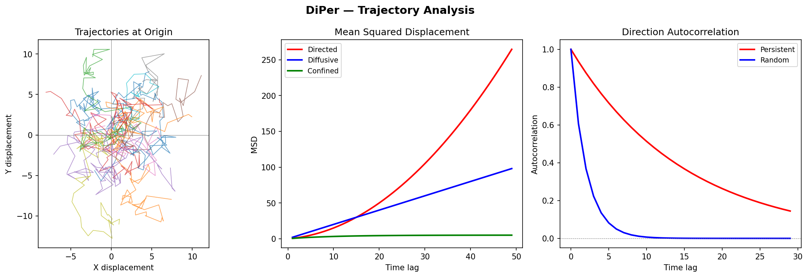

# DiPer Clone



A Python reimplementation of the DiPer (Directional Persistence) toolbox for analyzing cell migration trajectories. Provides direction autocorrelation, mean squared displacement, speed analysis, and other trajectory metrics.

## Features

- **Direction autocorrelation** (2D and 3D) with and without gap handling
- **Mean squared displacement (MSD)** analysis
- **Speed calculation** along trajectories
- **Directionality ratio** analysis
- **Velocity correlation**
- **Trajectory visualization** (plot at origin, sparse data handling)
- **Chart generation** from analysis results
- Modular design with shared utility functions

## Requirements

- Python 3.7+
- numpy, pandas, matplotlib

```bash
pip install numpy pandas matplotlib
```

## Usage

```python
from diper.autocorrel import direction_autocorrelation
from diper.msd import mean_squared_displacement
from diper.speed import calculate_speed

# Load trajectory data as a pandas DataFrame with x, y, (z), frame columns
# Run analyses
autocorr_results = direction_autocorrelation(trajectory_df)
msd_results = mean_squared_displacement(trajectory_df)
```

## Project Structure

```
diper_clone/
├── diper/
│   ├── init.py
│   ├── autocorrel.py          # Direction autocorrelation (2D)
│   ├── autocorrel_3d.py       # Direction autocorrelation (3D)
│   ├── autocorrel_nogaps.py   # Autocorrelation with gap handling
│   ├── dir_ratio.py           # Directionality ratio
│   ├── msd.py                 # Mean squared displacement
│   ├── speed.py               # Speed analysis
│   ├── vel_cor.py             # Velocity correlation
│   ├── plot_at_origin.py      # Origin-centered trajectory plots
│   ├── sparse_data.py         # Sparse data handling
│   ├── make_charts.py         # Chart generation
│   └── utils.py               # Shared utilities
├── data/                      # Example/test data
└── docs/                      # Documentation
```

## Reference

Based on the DiPer Excel-based toolbox for cell migration analysis.
